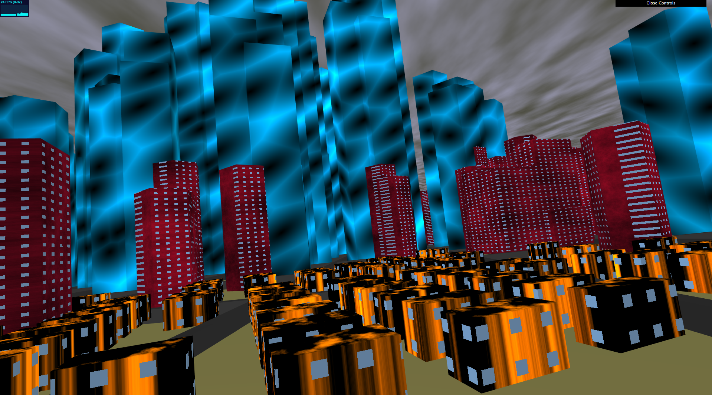

# City Generation
_Created for CIS 566 Homework 6 in Spring 2019_

_Wei (Waley) Zhang (PennKey: wzha)_

[github.io Demo](https://greedyai.github.io/city-generation/)

## Features
- My scene consists of the following elements:
  - __Procedurally generated buildings__: There are three different types of buildings: houses, apartments, and skyscrapers. They are created using the following techniques:
    - Houses are small buildings consisting of a single rectangular prism. They're all oriented according to a set of global axes and all have the same dimensions to give off the impression that my city has "rows" upon "rows" of houses. A given city block can contain up to dozens of houses aligned in a grid-like fashion. Houses are procedurally shaded using FBM with a standard noise function with quintic falloff for interpolation. Bias functions are also used to increase contrast in the texture. Windows have also been added to houses.
    - Apartments are medium-sized buildings consisting of 1 to 3 rectangular, pentagonal, or hexagonal prisms per apartment "extruded" from each other. These prisms are positioned, scaled, and oriented in such a way that each separate apartment's base is no smaller than its roof (see figure 3 of [Real-time Procedural Generation of 'Pseudo Infinite' Cities](procedural_infinite_cities.pdf) for an explanation of this process). They're quite a bit larger/taller than houses but not too large/tall to be a skyscraper. Apartments are procedurally shaded using FBM with a worley noise function. Windows have also been added to apartments.
    - Skyscrapers are large and tall buildings consisting of many rectangular, pentagonal, or hexagonal prisms per skyscraper "extruded" from each other. These prisms are positioned, scaled, and oriented in such a way that each separate skyscraper's base is no smaller than its roof (see figure 3 of [Real-time Procedural Generation of 'Pseudo Infinite' Cities](procedural_infinite_cities.pdf) for an explanation of this process). Their footprint is much larger than a single apartment so a single city block usually contains only one skyscraper. Skyscrapers are procedurally shaded using a single sample of a worley noise function.
    - The distribution of each of the three types of buildings closely follow the population density map. Areas with low population density spawn only houses. Areas with medium population density spawn only apartments. Areas with high population density spawn only skyscrapers. The population density gradient near these cutoffs are sharpened to reduce the chance that two different types of buildings will spawn in the same city block.
    - The height/complexity of the buildings also reflect the population density. The taller a building, the higher the population density is in that area. The more prisms a building consists of, the higher the population density is in that area. Whether or not a particular city block contains a building, and if so, how many buildings (assuming that the city block is within the required population thresholds) is a function of a noise function influenced by a "building density" variable: higher "building density" means more buildings spawned.
  - __Lighting & sky__:
    - The lighting in the scene is computed using the Blinn-Phong reflection model, which combines Lambertian shading, specular highlights, and ambient light. There is also a point source of light (aka the "sun") shining towards the ground. The sunlight combines diffuse shading, high specular reflection, and weak attenuation.
    - The sky is procedurally textured using FBM with a standard noise function with quintic falloff for interpolation, giving it a dense, cloudy look.
  - __Other elements__:
    - The roads/streets and terrain are procedurally generated based on the results of my previous project [here](https://github.com/greedyAI/road-generation). They have been shaded to interact with the lighting: an attenuated orange disk will reflect from the terrain (representing the sun) when the city is observed from a birds-eye view.
    - The roads/streets and terrain are rasterized to produce areas of "no-spawn zones" on top of which buildings are not allow to spawn. As such, no building lies on top of a road/street or extends into the water.

## Screenshots
- __Close-up view.__

- __In-city view.__

- __Birds-eye view.__

## Citations
I did not use any external resources when implementing this assignment.
