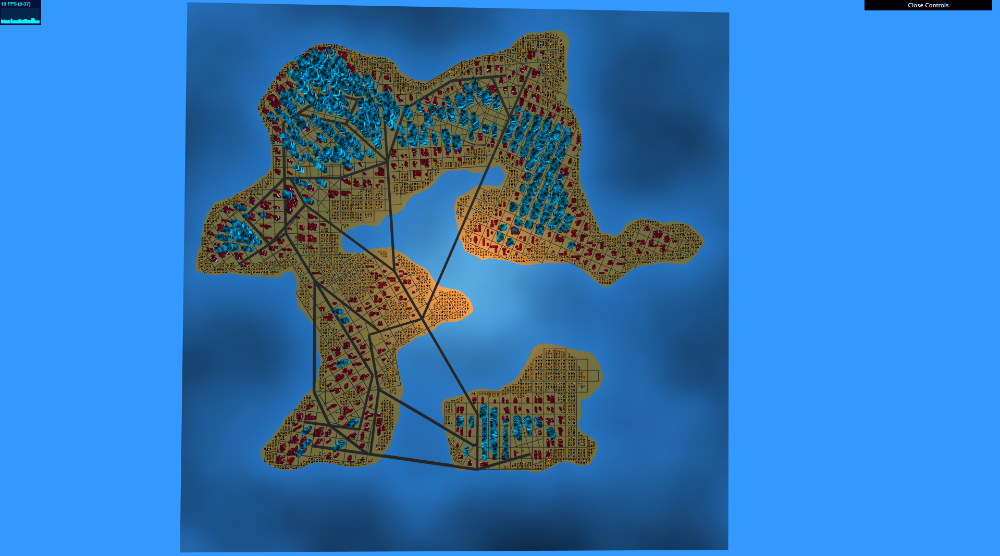

# City Generation
_Created for CIS 566 Homework 6 in Spring 2019_

_Wei (Waley) Zhang (PennKey: wzha)_

[github.io Demo](https://greedyai.github.io/city-generation/)

## Features
- My scene consists of the following elements:
  - __Procedurally generated buildings__: There are three different types of buildings: houses, apartments, and skyscrapers. They are created using the following techniques:
    - Houses are small buildings consisting of a single rectangular prism. They're oriented according to a set of global axes and all have the same dimensions to give off the impression that my city has "rows" upon "rows" of houses. Houses are procedurally shaded using FBM with a standard noise function with quintic falloff for interpolation. Bias functions are also used increase contrast in the texture. Windows have also been added to houses.
    - Apartments are medium-sized buildings consisting of 1 to 3 rectangular, pentagonal, or hexagonal prisms. They're quite a bit larger/taller than houses but not too large/tall to be a skyscraper. Apartments are procedurally shaded using FBM with a worley noise function. Windows have also been added to apartments.
    - Skyscrapers are large and tall buildings consisting of many rectangular, pentagonal, or hexagonal prisms configured in such a way that they all extrude from each other. They're much larger than apartments and are procedurally shaded using a single sample of a worley noise function.
    - The distribution and height of each of the three types of buildings closely follows the population density map. Areas with low population density spawn only houses. Areas with medium population density spawn only apartments. Areas with high population density spawn only skyscrapers. Also, the taller a building, the higher the population density is in that area.
  - __Lighting & Sky__:
    - There's a global directional light and also a point light representing a sun. The sunlight has diffuse shading, high specular reflection, and weak attenuation.
    - The sky is procedurally textured using FBM with a standard noise function with quintic falloff for interpolation.

## Screenshots
- __In-city view.__

- __Birds-eye view.__

## Citations
I did not use any external resources when implementing this assignment.
